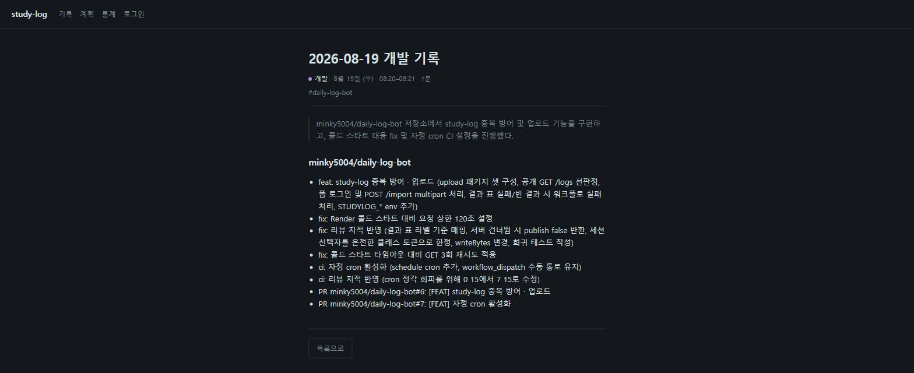

# daily-log-bot

> 매일 자정 · 계정 전체의 그날 커밋과 PR 을 TIL 한 장으로 접어 [study-log](https://study-log-n6ez.onrender.com) 에 올리는 봇

**산출물 — [2026-08-19 개발 기록](https://study-log-n6ez.onrender.com/logs/133)** · 배포된 화면이 아니라 매일 쌓이는 기록이 이 도구의 결과물 · 무료 티어 · 첫 접속은 기동 대기 30초 안팎



## 기술 스택

| 구분 | 기술 |
|---|---|
| Language | Java 21 |
| Build | Gradle 9.5.1 · `application` 플러그인으로 `./gradlew run` |
| HTTP · JSON | JDK `HttpClient` · Jackson (프레임워크 없음 · 직접 의존 1개) |
| 외부 | GitHub REST · Gemini `gemini-3.6-flash` 무료 티어 · study-log 폼 로그인과 `/import` |
| 실행 주체 | GitHub Actions `schedule` cron |
| Test | JUnit 5 · 66개 |

## 실행

실행 주체는 러너 — 로컬 실행은 검증 통로 · 전제는 JDK 21 · 시크릿 넷 · 변수 하나.

```bash
git clone https://github.com/minky5004/daily-log-bot.git && cd daily-log-bot
export GH_PAT=ghp_...                  # repo 범위 · 계정 전체 조회
export GEMINI_API_KEY=...
export STUDYLOG_BASE_URL=https://study-log-n6ez.onrender.com
export STUDYLOG_USERNAME=... STUDYLOG_PASSWORD=...
./gradlew run                          # 어제 하루를 수집 → 요약 → 조립 → 업로드
```

다섯 중 하나라도 누락 시 수집 전 중단 — 계정 전체를 다 돌고 나서야 키의 부재를 아는 실행은
GitHub 호출만 태우고 끝나는 것.

러너에서 밟는 통로.

```bash
gh workflow run daily-log.yml --ref dev -R minky5004/daily-log-bot
gh workflow run daily-log.yml --ref dev -f dry_run=true -R minky5004/daily-log-bot   # 올리지 않고 마크다운만
```

## 구조

```
daily-log-bot/
├── .github/workflows/daily-log.yml   KST 자정 cron · 90분 뒤 백업 발화 · 수동 실행(되돌리기 · dry-run)
└── src/main/java/com/minky/dailylogbot/
    ├── DailyLogBot.java              진입점 — 수집 → 요약 → 조립 → 업로드
    ├── collect/                      GitHub 조회 · KST 하루를 UTC 구간으로(DayWindow)
    ├── anonymize/                    private 세부 제거 — 이후 단계가 보는 유일한 입력
    ├── summarize/                    Gemini REST 호출 · 응답 검증(빈 값 · 상한 초과는 실행 실패)
    ├── assemble/                     세션 합산 · 프론트매터 마크다운 조립 · 태그
    └── upload/                       중복 선판정 · 폼 로그인 · _csrf 파싱 · multipart /import
```

수집 · 요약 · 업로드 셋 다 얇은 전송(`GitHubClient` · `GeminiClient` · `StudyLogClient`)과 판단
(`ActivityCollector` · `Summarizer` · `Uploader`)의 분리 — 실제 호출 없는 판단 테스트를 위한 선.
